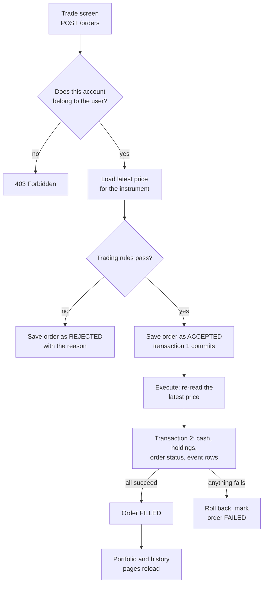

# LEAPvengers MVP Team Guide

2026-09-22 · Rafid Nasery

Sign-in, registration and the price feed already work on `main`; the MVP still needs trading, a portfolio page, order history and an audit trail. This guide says what to build, in what order, and how to split it across five people.

> **Which `main`?** This guide describes `main` on GitHub at commit `c1de545` (2026-09-21, PR #149). That commit added `HistoryController`, `TickerSearchController` and the price scripts. If your copy doesn't have them, your local `main` is out of date: run `git switch main` then `git pull`.

## Where we are today

Of the 15 must-have requirements, 2 are done, 5 are partly done and 8 have not been started. The two big pieces still to build are the three user roles (row 15), which every other permission depends on, and the trading engine (rows 3 to 7).

This table is our tracker. Update the Status column in a PR as work lands on `main`.

| # | Requirement, in plain English | Status | What exists on `main` today |
| --- | --- | --- | --- |
| 1 | A new user can register and sign in | Done | Register, login, forgot-password pages and `/auth` endpoints with JWT |
| 2 | Users only ever see their own data | Partly done | History endpoints read the user from the token. Nothing yet checks that an `accountId` belongs to the caller |
| 3 | A user can place a buy or sell order | Not started | `orders` table and `OrderRepository` only |
| 4 | Every order is checked against trading rules first | Not started | Nothing |
| 5 | An accepted order is saved before it is executed | Not started | Nothing |
| 6 | Execution uses the latest price at that moment | Not started | Prices exist in `price_quotes`, but nothing executes orders |
| 7 | A fill updates cash, holdings and the trade record together | Partly done | A database trigger updates holdings. Cash is not touched |
| 8 | A user can see their holdings and cash balance | Partly done | `PortfolioRepository` and history queries. No page yet |
| 9 | A user can see their order history, oldest to newest or newest first | Partly done | `/history/orders/*` endpoints, currently unreachable (see next section). No page yet |
| 10 | We support US/UK stocks, Indian stocks, FX and crypto | Partly done | All four are seeded, but FX and crypto are labelled `Cash` in `asset_class` |
| 11 | Prices come from our own database | Done | `yahoo_backfill.py` and `live_quote_generator.py`, run by `setup-dev.ps1` |
| 12 | Every order and every cash or holdings change is recorded permanently, with who and when | Not started | Nothing |
| 13 | We can replay any order's full story, from placed to final outcome | Not started | Nothing |
| 14 | Analysts can see trading activity by instrument, period and client segment | Not started | Nothing. `clients` has no segment column, so there is nothing to group by yet |
| 15 | Three kinds of user (Trader, Ops, Analyst), each seeing only what their role allows | Not started | Nothing. `users` has no role column, so every signed-in user is treated the same |

The official wording of each requirement is in the business requirements spec (BRS, requirements BR-01 to BR-17). If this table and the BRS disagree, the BRS wins.

## Fix these first

Five small problems on `main` will quietly break new features, so fix them before anything else. Each one is under an hour of work, which makes them good first PRs for people new to the repo.

1. **The schema script errors on a missing column.**
   - Where: `database/enterprise-schema.sql`, the line `CREATE INDEX users_account_id_idx ON users (account_id);`
   - Why it breaks: `users` has no `account_id` column. `psql` prints an error and carries on, so it is easy to miss.
   - Fix: delete that line.
   - Lesson: after any schema change, rebuild the database from scratch and read the whole output.
2. **The history and search endpoints live at `/api/api/...`.**
   - Where: `HistoryController` uses `@RequestMapping("/api/history")` and `TickerSearchController` uses `"/api/search"`.
   - Why it breaks: `application.properties` sets `server.servlet.context-path=/api`, which Spring adds to every URL. The real path becomes `/api/api/history`, and the frontend gets a 404.
   - Fix: use `"/history"` and `"/search"`, the same way `AuthController` uses `"/auth"`.
   - Lesson: test every new endpoint in Swagger UI (`http://localhost:8081/api/swagger-ui.html`) before you wire up the frontend.
3. **The frontend saves the token under one name and reads it under another.**
   - Where: `auth.service.ts` saves `authToken`, but `history.service.ts` reads `jwtToken`.
   - Why it breaks: history calls send `Bearer null` and get a 401.
   - Fix: add an HTTP interceptor that attaches the token to every request, and register it with `provideHttpClient(withInterceptors([authInterceptor]))` in `app.config.ts`. Then delete the hand-built headers in each service. Only `AuthService` should touch `localStorage`.
   - Lesson: when two files need the same value, give it one owner.
4. **FX and crypto are labelled as cash.**
   - Where: `instruments.asset_class` only allows `Equity`, `Bond`, `Fund` or `Cash`, so `BTC-USD` and `EURUSD=X` are stored as `Cash`.
   - Why it matters: requirement 10 asks for four categories, and the trade screen and reports need to tell them apart.
   - Fix: allow `Equity`, `FX` and `Crypto`, and add a `market` column (`US`, `UK`, `IN`) so Indian stocks can be told apart from US and UK ones. Update `seed.sql` to match.
5. **The database cannot tell kinds of user or client apart.**
   - Where: `users` has no `role` column, and `clients` has no `client_segment` column.
   - Why it matters: without `role`, we cannot build the three user roles (requirement 15). Without `client_segment`, analysts cannot group activity by segment (requirement 14).
   - Fix: add `role TEXT NOT NULL DEFAULT 'TRADER' CHECK (role IN ('TRADER', 'OPS', 'ANALYST'))` to `users`, and `client_segment TEXT NOT NULL DEFAULT 'RETAIL' CHECK (client_segment IN ('RETAIL', 'PREMIER', 'PRIVATE'))` to `clients`. Ops and Analyst users do not belong to a client, so `users.client_id` must allow `NULL` for them. Seed one Ops user, one Analyst user, and traders in more than one segment. Update the `Users` and `Clients` entities to match; `ddl-auto=validate` will refuse to start the backend until you do.
   - Lesson: `CHECK` constraints stop bad data at the door, which is cheaper than finding it later.

Worth cleaning up once these five are done:

- History and search endpoints read data but use `POST`. Reads should use `GET`.
- There are 20 near-identical history endpoints, one per time period. A single endpoint with a query parameter (`GET /history/orders?period=1m`) does the same job in about a quarter of the code.
- Angular renders on the server (SSR), where `localStorage` does not exist. Wrap storage access in a check such as `isPlatformBrowser`, or the server render will crash.
- Jenkins runs with `-DskipTests`. Turn tests back on as soon as the first real test exists (Milestone 1).

## The big picture

The heart of the MVP is one flow: a user places an order, we check it, save it, execute it, and update their cash and holdings in a single step. Everything else either feeds this flow (prices, sign-in) or reads what it leaves behind (portfolio, history, audit, reports).

Read it top to bottom. Every box that says "save" or "mark" also writes a row to an `order_events` table, which gives us requirements 12 and 13 almost for free.

Three ideas carry most of the design, and they are worth understanding before anyone writes code:

- **Two transactions, not one.** Transaction 1 saves the accepted order. Transaction 2 does the money movement. If transaction 2 fails, the order is still on record as accepted-then-failed, which is exactly what requirement 5 asks for.
- **All or nothing.** Inside transaction 2, the cash change, the holdings change and the status change either all happen or none do. In Spring you get this by putting `@Transactional` on one service method that does all three writes. If any line throws, the whole thing is undone.
- **Never edit history.** Rows in `order_events` and `cash_transactions` are only ever inserted, never updated or deleted. To undo something you add a new row. This is how banks keep records, and it is what makes the audit trail trustworthy.

## The three user roles

Every signed-in user has exactly one role, and the backend decides what they may do from that role alone. The frontend only hides buttons for convenience; it is never the real protection.

| Role | Who they are | Can do | Cannot do | Lands on after sign-in |
| --- | --- | --- | --- | --- |
| Trader | A retail client of the platform | Register, trade in their own accounts, see their own portfolio and history | See anyone else's data, or any `/internal` page | `/dashboard` |
| Ops | Operations staff | Look up any order and its full timeline, look up any client | Place trades | `/internal/orders` |
| Analyst | Reporting staff | See totals of trading activity by instrument, period and client segment | Place trades, or see an individual client's orders or details | `/internal/reports` |

How it fits together:

1. **Database:** `users.role` holds `TRADER`, `OPS` or `ANALYST` (fix 5 above). Traders have a `client_id`; Ops and Analysts do not.
2. **Sign-up:** the public register page only ever creates Traders. Ops and Analyst users are created in `seed.sql`, never through the website.
3. **Token:** `JwtUtil` adds a `role` claim to the token, next to `userId` and `clientId`.
4. **Backend:** `JwtAuthenticationFilter` turns that claim into a Spring authority (`ROLE_TRADER` and so on). `SecurityConfig` then protects whole URL groups in a few lines:
   - `/accounts/**` and `/orders/**`: `hasRole("TRADER")`
   - `/internal/audit/**`: `hasRole("OPS")`
   - `/internal/reports/**`: `hasAnyRole("ANALYST", "OPS")`
5. **Frontend:** the login response includes the role. A role guard on each route sends users to their own landing page, and the top bar shows only the links their role can use.

Roles and ownership are two separate checks, and you need both. The role check says "Traders may call `/accounts/{id}`". The ownership check (`OwnershipService`, Milestone 1) says "but only for their own account ids".

## The plan: five milestones

Build in this order: foundations, then read-only pages, then the trading engine, then the trade screen, then audit and reports. Each milestone ends in something you can demo, so if time runs out you still have a working product rather than five half-built features.

Tick the boxes as PRs merge.

### Milestone 1: Foundations

Goal: each role signs in and lands on its own protected (empty) page, and the backend knows who is calling and what their role is.

- [ ] Fix the five problems in "Fix these first"
- [ ] Backend: add the `role` claim to the JWT and return `role` in the login response
- [ ] Backend: turn the claim into a Spring authority in `JwtAuthenticationFilter`, and add the role rules from "The three user roles" to `SecurityConfig`
- [ ] Schema: allow order statuses `ACCEPTED`, `FILLED`, `REJECTED` and `FAILED`, and add a `reject_reason` column to `orders`
- [ ] Schema: add an `order_events` table (`event_id`, `order_id`, `event_type`, `details`, `created_at`, `created_by`)
- [ ] Backend: a small helper such as `CurrentUser.clientId()` that reads the client id from the JWT, so no controller parses tokens by hand
- [ ] Backend: an `OwnershipService.requireAccount(accountId)` that throws 403 unless the account belongs to the caller's client
- [ ] Backend: write one real integration test, then remove `-DskipTests` from the `Jenkinsfile`
- [ ] Frontend: an auth guard that sends signed-out users to `/sign-in`, and a role guard that sends signed-in users to their own landing page
- [ ] Frontend: an app shell whose top bar shows each role's links (Traders: Dashboard, Trade, History; Ops: Orders, Clients; Analysts: Reports; everyone: Sign out), plus empty `/dashboard`, `/internal/orders` and `/internal/reports` routes
- [ ] Tests: a Trader gets 403 on `/internal/**`, and Ops and Analysts get 403 on `/accounts/**` and `/orders/**`

Done when: the seeded Trader, Ops and Analyst users each land on their own page after sign-in, and visiting any of those pages while signed out bounces you to `/sign-in`.

### Milestone 2: Read-only pages

Goal: users can see their money and prices, before we let them trade.

- [ ] `GET /accounts`: the caller's accounts with cash balance
- [ ] `GET /accounts/{id}/portfolio`: cash plus each holding with ticker, name, quantity, latest price and value (quantity × price)
- [ ] `GET /instruments`: everything tradable, with asset class and market
- [ ] `GET /quotes/{instrumentId}`: latest price and its timestamp
- [ ] Dashboard page: cash balance, a holdings table and the total value
- [ ] Tests: user A gets 403 when asking for user B's account

Done when: the seeded test user sees their $100,000 cash on the dashboard, and changing the account id in the URL gives a 403.

### Milestone 3: The trading engine (the hardest part)

Goal: `POST /orders` works end to end from Swagger UI. Put your strongest pair on this.

- [ ] A `TradingRules` class with one method per rule: quantity above zero; instrument exists; a price exists and is recent enough; enough cash for a buy; enough shares for a sell
- [ ] A unit test for every rule, covering both a pass and a fail
- [ ] `OrderService.placeOrder`: check ownership, run the rules, then save as `ACCEPTED` or `REJECTED` (transaction 1)
- [ ] `OrderExecutionService.execute`: re-read the price, then in one `@Transactional` method move cash, update holdings, add a `cash_transactions` row, set `FILLED` and write the events (transaction 2)
- [ ] If execution throws, mark the order `FAILED` in a new transaction and record why
- [ ] Rejections return HTTP 422 with a clear message such as `{"code": "INSUFFICIENT_CASH", "message": "..."}`
- [ ] Integration tests: a buy moves cash and holdings; a buy that is too big changes nothing; a sell of shares you do not own is rejected

Two traps in this milestone:

- **The database already updates holdings.** The `orders_sync_holdings` trigger adds to `holdings` whenever an order becomes `Filled`. If Java also updates holdings, every trade counts twice. Pick one; we recommend deleting the trigger and doing it in Java, where you can see it and test it.
- **Prices stop outside US market hours.** `live_quote_generator.py` only runs 9:30am to 4pm ET on weekdays. Make the "recent enough" limit a setting in `application.properties`, and set it very generously on your laptops, or every evening demo will be rejected as "stale price".

Done when: in Swagger you buy 10 NFLX, then see cash drop by 10 × the price, a new NFLX holding and a `FILLED` order.

### Milestone 4: Trade screen and history

Goal: everything from Milestone 3, usable in the browser.

- [ ] Trade page: pick an account, pick an instrument (grouped by US/UK stocks, Indian stocks, FX, crypto), pick Buy or Sell, enter a quantity, and see the latest price
- [ ] Refresh the price every 5 seconds with a simple timer. Polling is fine for the MVP.
- [ ] Show the estimated cost before submitting, and the server's rejection reason after a failed submit
- [ ] After a successful order, go to (or refresh) the dashboard
- [ ] `GET /orders`: the caller's orders, newest first, with ticker, side, quantity, price, status and times
- [ ] History page: a table of those orders

Done when: a teammate who has never seen the app can sign in, buy something, see it on the dashboard, and find it in history without help.

### Milestone 5: Audit trail and reports

Goal: Ops can prove what happened to any order, and Analysts can see activity.

For Traders:

- [ ] `GET /orders/{id}/events`: the order's full timeline from `order_events` (own orders only)
- [ ] Show that timeline when a Trader clicks an order on the history page

For Ops:

- [ ] `GET /internal/audit/orders`: all orders, filterable by client, instrument, status and date
- [ ] `GET /internal/audit/orders/{id}`: one order's full timeline, including the price used and the cash and holdings changes
- [ ] `GET /internal/audit/clients/{id}`: a client's details, accounts and recent orders
- [ ] Ops pages: an orders list, an order timeline and a client lookup

For Analysts:

- [ ] A materialized view that totals filled trades by instrument, day and `client_segment`, refreshed every few minutes by a Spring `@Scheduled` job. Reports read this view, never the live `orders` table, so heavy reports cannot slow trading down.
- [ ] `GET /internal/reports/activity?from=&to=&groupBy=instrument|day|segment`: totals only, no client names or ids
- [ ] Analyst page: that table with date and grouping filters

Done when: Ops can open any order and see its whole story; the Analyst sees this week's trades grouped by instrument and by segment; and a Trader gets 403 on both `/internal` URLs.

### Finish line

- [ ] Rebuild everything from scratch on a laptop that has never run the project, following only `SETUP_GUIDE.md`
- [ ] Write a demo script with all three roles: a Trader signs up, buys, sells, hits a rejected order and checks history; Ops opens that rejected order's timeline; the Analyst shows activity by segment
- [ ] Rehearse the demo twice

## Who does what

Split into five lanes so nobody waits on anybody else. Put a name in each row, and swap lanes after Milestone 3 so everyone touches both backend and frontend before the project ends.

| Lane | Who | Owns | Main work |
| --- | --- | --- | --- |
| A. Database and data | | `database/`, seed data, price scripts | Fixes 1, 4 and 5, the new columns and tables, the Analyst reporting view |
| B. Security, roles and accounts | | JWT role claim, role rules, ownership checks, account APIs | `CurrentUser`, `SecurityConfig` role rules, `OwnershipService`, `/accounts` endpoints, the 403 tests for every role |
| C. Trading engine | | `TradingRules`, `OrderService`, execution | Milestone 3, then the Ops audit endpoints. Pair with lane B for the first few days |
| D. Frontend shell and Trader pages | | Guards, interceptor, role-aware shell, dashboard, history | Fix 3, then the dashboard and history pages |
| E. Frontend trading, internal pages and QA | | Trade page, Ops and Analyst pages, tests, demo script | The trade page, the Ops and Analyst pages, the Jenkins test run, the Finish line checklist |

Three habits keep five people from tripping over each other:

- **Agree the API before building it.** Before lane C writes `POST /orders`, lanes C and E write down the request and response JSON together, in the PR description or a GitHub issue. The frontend can then build against fake data while the backend is still in progress.
- **Pair on the hard bits.** The trading engine and the ownership checks are where money bugs hide. Two people at one screen for those is faster than one person plus a long review.
- **One owner per file at a time.** If two people need to change `enterprise-schema.sql` in the same week, one waits or they pair. Merge conflicts in SQL are painful.

## How to work as a team

Small branches, small PRs, and a shared definition of "done" matter more than any technical choice in this guide.

**Branches and PRs**

1. One branch per checklist item, cut from an up-to-date `main`: `git switch main`, `git pull`, `git switch -c feat/orders-endpoint`.
2. Keep PRs under about 300 changed lines. A small PR gets a real review; a 2,000-line PR gets "LGTM".
3. Pull `main` into your branch every day, so conflicts stay small.
4. Every PR description answers three questions: what changed, why, and how a reviewer can test it (the exact URL or steps, plus a screenshot for UI work).
5. At least one teammate approves before merging. Reviewing is the best way to learn the parts of the codebase you did not write, so share it around.

**Definition of done.** A checklist item is done only when all of these are true:

- It is merged to `main`, and Jenkins is green
- It works after rebuilding the database from scratch with `setup-dev.ps1`
- New backend logic has at least one test, and new endpoints have been tried in Swagger UI
- The Status column in the tracker table above is updated

**Daily rhythm**

- A 15-minute stand-up: what I finished, what I am doing next, what is blocking me.
- **The 30-minute rule:** if you have been stuck for 30 minutes, ask. Being stuck for a whole afternoon helps nobody. Asking early is a professional skill, not a weakness.
- Demo to each other at the end of every milestone, even when it is rough.

**Secrets.** `application.properties` contains the database password and the JWT secret. That is fine for local development, but never put a real password in git. Before anything is deployed, move both into environment variables (`.env.example` is already there for this).

## Keep it simple

The MVP needs to be correct, not clever. Whenever there is a simple way and a fancy way, take the simple way and write the fancy way down as "future work" for the final presentation.

| Topic | Do this for the MVP | Skip or postpone |
| --- | --- | --- |
| Database access | Keep Spring Data JPA, which you already know. Use `@Query` with plain SQL for anything tricky | Switching to MyBatis or another tool |
| Order types | Market orders only, filled in full at the latest price | Limit orders, partial fills, cancelling |
| Executing orders | Execute straight after saving, in the same HTTP request, as two separate transactions | Background queues, retry jobs, recovery on restart |
| Live updates | Poll every few seconds with a timer | WebSockets, Server-Sent Events |
| Currencies | Store each instrument's currency. Convert with the FX prices you already have if time allows; otherwise treat everything as USD and say so in the demo | A full multi-currency cash ledger |
| Roles | Exactly one role per user, fixed in the database | Admin screens for managing users or changing roles |
| Reports | One materialized view and one table on the Analyst page | Charts, exports, dashboards |
| Forgot password | Leave the current placeholder | Sending real emails |
| Styling | Plain and tidy until Milestone 4 is done | Polishing pages before they work |

One Spring gotcha that will bite the two-transaction design: `@Transactional` does nothing when a method calls another method in the same class. Spring only starts a transaction when the call comes from another bean. That is why the plan has two classes, `OrderService` and `OrderExecutionService`. Keep them separate.

Out of scope for this whole phase: real payments or banking, mobile apps, identity checks, and live stock exchange connections.

## Learning tips

The fastest way to learn this codebase is to follow one feature that already works all the way through, before building a new one.

**Exercise for everyone in week one.** Follow a login request from button to database and back, opening each file as you go:

1. `sign-in.component.ts`: the button calls `authService.login()`
2. `auth.service.ts`: sends `POST /api/auth/login`
3. `proxy.conf.json`: the Angular dev server forwards `/api` to port 8081
4. `AuthController.login` → `AuthService.login` → `UserRepository.findByUsername`
5. BCrypt checks the password, and `JwtUtil` builds the token
6. Back in the browser, the token is saved to `localStorage`

Every feature in the plan has the same shape: component → service → controller → service → repository → table.

**When something breaks**

- **Look at the browser's Network tab first** (F12). The status code tells you where to look: 404 means the URL is wrong, 401 means the token is missing or bad, 403 means ownership was refused, 500 means check the backend log.
- **Read Java stack traces from the bottom.** The last `Caused by:` line is usually the real problem.
- **Check the data, not just the code.** Open `psql` and `SELECT` the rows you expect. Many "code bugs" turn out to be missing seed data.
- **Use the debugger.** A breakpoint in VS Code or IntelliJ beats twenty `System.out.println` lines.

**Using AI tools well**

- Ask it to explain code, errors and concepts. Be careful about asking it to write whole features.
- If AI-written code goes into a PR, the author must be able to explain every line in review. If you cannot, you do not understand it yet.
- Try the problem yourself first, even for 20 minutes. The struggle is where the learning happens.

**Worth reading** (short, official, and matching what we use):

- [Building a RESTful web service](https://spring.io/guides/gs/rest-service) (Spring)
- [Accessing data with JPA](https://spring.io/guides/gs/accessing-data-jpa) (Spring)
- [Declarative transaction management](https://docs.spring.io/spring-framework/reference/data-access/transaction/declarative.html), essential before Milestone 3 (Spring)
- [Transactions tutorial](https://www.postgresql.org/docs/current/tutorial-transactions.html), a bank-transfer example very close to our fill step (PostgreSQL)
- [Angular tutorials](https://angular.dev/tutorials), [HTTP interceptors](https://angular.dev/guide/http/interceptors) and [route guards](https://angular.dev/guide/routing/route-guards) (Angular)
